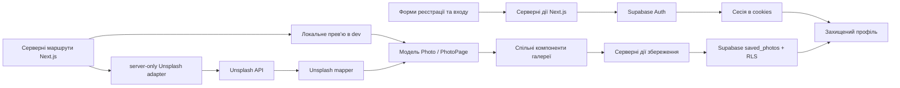

# Photo Gallery Test

Навчальний проєкт галереї фотографій. Поточний стан: **етап 9 — особиста добірка фото**. Є серверна стрічка, адаптивні вирівняні ряди фото, атрибуція, перемикач 3/5 кадрів у ряд, сторінкова пагінація, детальна сторінка фото, результати за тегом, пошук, авторизація та збереження фото. Послідовність роботи описана в [DEVELOPMENT_PLAN.md](./DEVELOPMENT_PLAN.md).

Покрокові налаштування Production Deploy, Supabase callback і перевірок після публікації — у [DEPLOYMENT.md](./DEPLOYMENT.md).

## Перед запуском

- Node.js **22.x** та npm. Локально перевірено на Node.js 22.17.1; цю ж major-версію використовує деплой.
- Якщо `node_modules` немає (наприклад, після клонування репозиторію), із кореня цієї папки виконайте `npm ci`: `package-lock.json` уже створено, тому `npm install` для першого встановлення не потрібен.
- У `.env.local` впишіть отриманий Unsplash Access Key: `UNSPLASH_ACCESS_KEY=ваш_ключ`. Залиште назву без префікса `NEXT_PUBLIC_`: ключ читає лише серверний модуль. Без ключа галерея покаже повідомлення про налаштування.
- Для облікового запису й добірки в `.env.local` потрібні `SUPABASE_URL` і `SUPABASE_PUBLISH_KEY`. `APP_ORIGIN` локально за замовчуванням дорівнює `http://localhost:3000`; на хостингу обов’язково задайте публічний HTTPS origin. Назви й приклади є в `.env.example`. Publishable key можна передавати клієнту, але поточна інтеграція використовує його лише на сервері. Пароль БД застосунку не потрібен: він використовувався лише для застосування міграції.
- Запустіть `npm run dev` та відкрийте `http://localhost:3000`.

## Перегляд без витрати ліміту API

В режимі розробки відкрийте `http://localhost:3000/?preview=1`. Це локальний макет галереї з абстрактними SVG-зображеннями, без запитів до Unsplash. У ньому є дві сторінки по 12 карток. Сторінки фото, теги, пошук, пагінація й повернення до результатів також працюють з локальними даними. Наприклад, `http://localhost:3000/search?q=abstract&preview=1` показує результати на двох сторінках. Режим доступний лише при `npm run dev`; звичайна головна сторінка отримує справжні фото через серверний API-запит.

На широких екранах кнопки перемикають щільність: до 3 або 5 кадрів у ряд без нового запиту за фото. Фото мають спільну висоту в межах ряду, а ширина залежить від їхніх пропорцій. Короткий останній ряд балансується з попереднім. На вузьких екранах сітка автоматично переходить до 2 або 1 кадру в ряд. `page` і `cols` зберігаються в URL; посилання пагінації не підвантажують інші сторінки наперед, щоб не витрачати API-ліміт.

**Дизайн:** після перегляду обрано вирівняні ряди замість початкового masonry для рівного нижнього краю. Це зміна трактування R2/R3, а не початкова вимога DOCX. Сторінкова пагінація збережена відповідно до R4.

## Фото й теги

Картка веде до `/photos/[id]`. Сторінка показує опис, автора, розміри, кількість лайків (коли її надає API) та теги. Натискання тега відкриває `/tags/[tag]` із тією ж сіткою й пагінацією. У робочому режимі результати отримуються серверним пошуком Unsplash за назвою тега; це пошукові результати, а не окрема колекція Unsplash. Посилання «До галереї» повертає на сторінку й режим сітки, з яких відкрили фото. У прев’ю теги фільтрують локальні приклади, зокрема є фото без тегів і лайків для перевірки порожніх значень.

## Пошук

Посилання в шапці відкриває `/search`. Форма надсилає `q` через URL і кожний новий запит починає зі сторінки 1. Результати використовують ту ж сітку, перемикач 3/5 і пагінацію. Повернення зі сторінки фото відновлює пошукове слово, сторінку й режим сітки. Порожній запит показує теми для старту без API-запиту; відсутні результати мають окремий стан. У локальному прев’ю пошук фільтрує назви, описи й теги прикладів.

## Обліковий запис

`/register` і `/login` мають власні форми email + пароль. Пароль перевіряється й передається Supabase Auth через серверну дію; застосунок не зберігає його самостійно. Кнопка-камера в полі пароля перемикає видимість із коротким ефектом проявлення кадру. Ефект ізольовано в `src/components/auth/PasswordField.*`, а для `prefers-reduced-motion` він вимкнений.

Після входу `/profile` перевіряє підписаний токен на сервері. Неавторизований відвідувач переходить на `/login`; вихід видаляє сесію. Профіль має явні розділи акаунта і збережених фото. У стрічці, пошуку, тегах і на сторінці фото кнопка ♡ додає кадр у добірку; повторне натискання прибирає його. У профілі можна переглядати добірку по 12 фото на сторінку й видаляти фото. Гість через кнопку переходить до входу. Supabase Auth зберігає користувачів; окремої таблиці профілю для email не потрібно. Локальний `?preview=1` залишається доступним за прямим URL і не витрачає Unsplash API.

Особиста добірка зберігається в `public.saved_photos`. Міграція `supabase/migrations/20261009083238_saved_photos.sql` уже застосована до поточного Supabase-проєкту. Для іншого проєкту її потрібно застосувати окремо через Supabase CLI або SQL Editor до перевірки кнопок збереження. У таблиці лежать ID, URL і короткі метадані фото, самі файли не копіюються. Профіль читає ці дані без додаткових запитів до Unsplash. Для `anon` таблиця недоступна, а RLS дозволяє авторизованому користувачу бачити й змінювати лише власні рядки. `DB_PASSWORD` та connection string не додавайте до Git чи змінних середовища застосунку на хостингу.

На hosted Supabase підтвердження email зазвичай увімкнено. Після реєстрації форма просить перевірити пошту; стандартне посилання веде через `/auth/callback`, де код підтвердження обмінюється на сесію. У Supabase Dashboard → **Authentication → URL Configuration** додайте `http://localhost:3000/auth/callback` до дозволених Redirect URLs. На деплої додайте відповідний HTTPS URL і задайте `APP_ORIGIN` на адресу сайту. Не використовуйте для цього пароль БД або secret/service role key.

Для нових безкоштовних проєктів стандартний поштовий сервіс Supabase може надсилати листи лише адресам команди й має малий ліміт. Тому для локальної перевірки використайте власну адресу, додану до команди проєкту; для доступної всім реєстрації після деплою знадобиться налаштувати власний SMTP. [Обмеження SMTP](https://supabase.com/docs/guides/auth/auth-smtp), [зміна щодо шаблонів Free plan](https://supabase.com/changelog/46599-changes-to-email-template-customisation-on-free-tier).

Chrome може додавати до `<body>` атрибут `cz-shortcut-listen="true"` через розширення ще до запуску React. На `<body>` поставлено вузький `suppressHydrationWarning`, щоб не показувати помилку лише через сторонній атрибут; вкладені елементи продовжують перевірятися. Якщо з'явиться інший hydration diff, перевірте сторінку в приватному вікні без розширень і повідомте про відмінність.

Колаж повторно використовує вже отримані фото галереї. Для реакції на рух вказівника, наведення на картки й перемикання щільності використано Motion з `LazyMotion`; налаштування `prefers-reduced-motion` враховане. Розрахунки сітки виконуються на сервері, адаптивність забезпечує CSS без вимірювань DOM у JavaScript.

## Перевірки після встановлення залежностей

- `npm run lint`
- `npm run typecheck`
- `npm run test`
- `npm run format:check`
- `npm run build`

`npm run format` застосовує єдине форматування TypeScript, TSX і CSS через Prettier.

Локальний `.env.local`, `node_modules` і результати збірки ігноруються Git. При деплої ключ треба додати до змінних середовища хостингу.

## API-шар

`src/lib/unsplash/server.ts` — серверна точка входу для стрічки, окремого фото та пошуку. Вона читає ключ зі змінної середовища й використовує `src/lib/unsplash/client.ts` для запитів. `src/lib/unsplash/mapper.ts` перетворює відповіді API на стабільну модель із `src/lib/photos.ts`, зберігаючи прямі URL зображень.

Списки та пошук кешуються на 5 хвилин, деталі фото — на 1 годину. Час очікування API-запиту обмежено 10 секундами. Клієнт нормалізує `page` і `per_page`, читає метадані пагінації та розрізняє помилки конфігурації, мережі, авторизації, ліміту запитів і пошкодженої відповіді. Автоматичних live-запитів у тестах немає: `npm run test` працює з підставними відповідями й не витрачає ліміт Unsplash.

## Архітектура та стани

`src/lib/photos.ts` містить незалежну від провайдера модель; парсинг відповіді Unsplash лежить у `src/lib/unsplash/mapper.ts`. Ключ доступний лише `server-only` адаптеру. У клієнті залишено інтерактивні частини: перемикач колонок, контекст повернення з фото, колаж та кнопка повторення запиту. Анімація карток і розрахунок сітки не потребують окремого клієнтського JavaScript.

Авторизація ізольована в `src/lib/auth` та `src/lib/supabase`. Серверна дія перевіряє введення, Supabase Auth керує сесією, а `/profile` перевіряє claims токена на сервері. Дії збереження в `src/lib/saved-photos/actions.ts` повторно перевіряють сесію та дані фото. `GalleryResults` отримує статус усіх видимих фото одним запитом до Supabase; профіль читає сторінку збережених метаданих.

Для головної, пошуку й тегів є скелетон під час переходу. Помилки API мають повідомлення та дію повторення, непередбачені помилки — окрему сторінку, невідомі маршрути й фото — 404. Для фото loader не запускає ранній HTTP 200: відсутнє фото повертає справжній HTTP 404. Назви сторінок пошуку та фото залежать від їхнього вмісту. Посилання в галереї не завантажують наступні маршрути наперед, щоб берегти API-квоту.

Перед публічним деплоєм треба окремо визначити обмеження запитів на рівні хостингу: кеш зменшує повторні звернення, але нові пошукові слова та ID фото можуть створювати нові запити до Unsplash.
